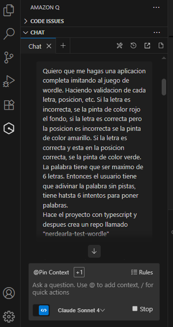

# Nerdearla Test Wordle

Una implementación completa del juego Wordle en TypeScript.

## Características

- Palabras de 6 letras
- 6 intentos máximos
- Validación de letras con colores:
  - 🟩 Verde: Letra correcta en posición correcta
  - 🟨 Amarillo: Letra correcta en posición incorrecta
  - 🟥 Rojo: Letra no está en la palabra
- Teclado virtual interactivo
- Soporte para teclado físico

## Instalación y Uso

1. Instalar TypeScript (si no lo tienes):
```bash
npm install -g typescript
```

2. Compilar el código TypeScript:
```bash
npm run build
```

3. Servir la aplicación:
```bash
npm run serve
```

4. Abrir en el navegador: `http://localhost:8000`

## Cómo Jugar

1. Escribe una palabra de 6 letras
2. Presiona ENTER para enviar tu intento
3. Observa los colores de las letras para obtener pistas
4. Tienes 6 intentos para adivinar la palabra correcta

¡Buena suerte!

